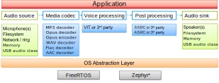

# Maestro audio framework

## Introduction

Maestro audio framework intends to enable chaining of basic audio processing blocks, called *elements*. These blocks then form stream processing objects, called *pipeline*.
This pipeline can be used for multiple audio processing use cases.

The processing blocks can include (but are not limited to) different audio sources (for example file or microphone), decoders or encoders, filters or effects, and audio sinks. Framework overview is depicted in the following picture:

\*not all elements and libraries are supported in Zephyr port. For more information, see [Maestro on Zephyr](zephyr/README.rst)

The Maestro audio framework is an open-source component developed by NXP Semiconductors and released under the BSD-compatible license. It is running on RTOS (Zephyr or FreeRTOS), abstracted by OSA layer.

For detailed description of the audio Maestro framework, please refer to the [programmer's guide](doxygen/ProgrammersGuide.md).

To see what is new, see [changelog](CHANGELOG.md).

## Maestro on Zephyr

Getting started guide and further information for Maestro on Zephyr may be found [here](zephyr/README.rst).

## Maestro on FreeRTOS

Maestro on FreeRTOS is supported in NXP's SDK. To get started, see [mcuxsdk repository](https://github.com/nxp-mcuxpresso/mcuxsdk-manifests).

### Supported examples {#supported-examples}

The current version of the Maestro audio framework supports several optional [features](supported_features.md), some of which are used in these examples:

- [maestro_playback](doxygen/maestro_playback.md)
- [maestro_record](doxygen/maestro_record.md)
- [maestro_usb_mic](doxygen/maestro_usb_mic.md)
- [maestro_usb_speaker](doxygen/maestro_usb_speaker.md)
- [maestro_sync](doxygen/maestro_sync.md)

The examples can be found in the **audio_examples** folder of the desired board. The demo applications are based on FreeRTOS and use multiple tasks to form the application functionality.

### Example applications overview

To set up the audio framework properly, it is necessary to create a streamer with `streamer_create` API. It is also essential to set up the desired hardware peripherals using the functions described in `streamer_pcm.h`.
The Maestro example projects consist of several files regarding the audio framework. The initial file is `main.c` with code to create multiple tasks.
For features including SD card (in the maestro_playback examples, reading a file from SD card is supported and in maestro_record writing to SD card is currently supported) the `APP_SDCARD_Task` is created.
The command prompt and connected functionalities are handled by `APP_Shell_Task`.

One of the most important parts of the configuration is the `streamer_pcm.c` where the initialization of the hardware peripherals, input and output buffer management can be found. For further information please see also `streamer_pcm.h`

In the Maestro USB examples (maestro_usb_mic and maestro_usb_speaker), the USB configuration is located in the `usb_device_descriptor.c`, `audio_microphone.c` and `audio_speaker.c` files. For further information please see also `usb_device_descriptor.h`, `audio_microphone.h` and `audio_speaker.h`.

In order to be able to get the messages from the audio framework, it is necessary to create a thread for receiving the messages from the streamer, which is usually called a `Message Task`.
The message thread is placed in the `app_streamer.c` file, reads the streamer message queue, and reacts to the following messages:

- STREAM_MSG_ERROR -  stops the streamer and exits the message thread
- STREAM_MSG_EOS - stops the streamer and exits the message thread
- STREAM_MSG_UPDATE_DURATION - prints info about the stream duration
- STREAM_MSG_UPDATE_POSITION - prints info about current stream position
- STREAM_MSG_CLOSE_TASK - exits the message thread

## File structure

| Folder | Description |
|:---|:---|
| src | Maestro audio framework sources |
| src/inc | Maestro include files |
| src/core | Maestro core sources |
| src/cci | Common decoder interface sources |
| src/cei | Common encoder interface  sources |
| src/elements | Maestro elements sources |
| src/devices | External audio devices implementation (audio source & audio sink elements) |
| src/utils | Helper utilities utilized by Maestro |
| docs | Generated documentation |
| doxygen | Documentation sources |
| components | Glue for audio libraries, so they can be used in elements |
| tests | Maestro tests |
| zephyr/ | Zephyr related files |
| zephyr/samples/ | Zephyr samples |
| zephyr/tests/ | Zephyr tests |
| zephyr/audioTracks/ | Audio tracks for testing |
| zephyr/wrappers/ | Zephyr NXP SDK Wrappers |
| zephyr/doc/ | Zephyr documentation configuration for Sphinx |
| zephyr/scripts/ | Zephyr helper scripts, mostly for testing |

## Contribution to the Maestro project

We welcome and encourage the community to submit patches directly to the Maestro project placed on github.
Contributing can be managed via pull-requests.
