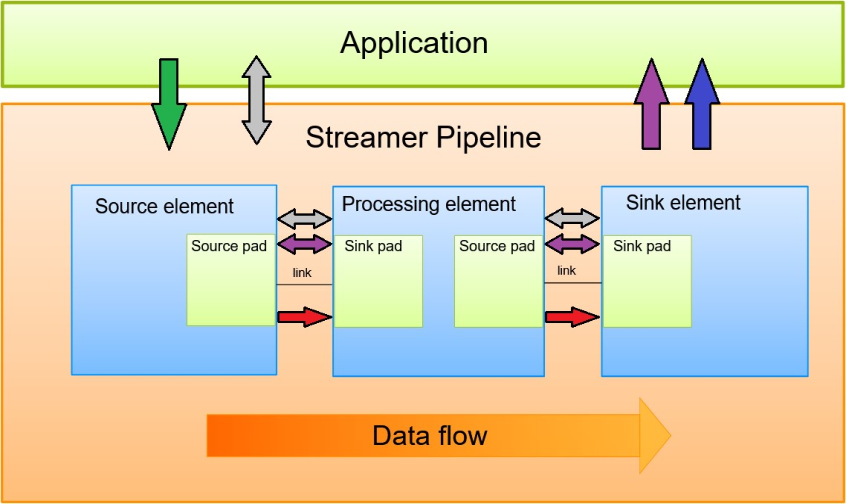

# Maestro Audio Framework Programmer's Guide

## Introduction

Maestro audio framework provides instruments for playback and capture of different audio streams. In order to do that the framework uses API for creating various audio and voice pipelines with the support of media and track information.
This document describes the framework in its detail, and the usage of API for pipeline creation using different elements. The framework needs an operating system in order to create different tasks for audio processing and communication with the application.

## Architecture overview

A high-level block diagram of the streamer used in Maestro is shown below. An element is the most important class
of objects in the streamer (see `streamer_element.c`). A chain of elements will be created and linked together when a [pipeline](#pipeline) is
created. Data flows through this chain of elements in form of data buffers. An element has one specific function, which can be the reading
of data from a file, decoding of this data, or outputting this data to a sink device. By chaining together several such
elements, a pipeline is created that can do a specific task, for example, the playback.

## Pipeline


The pipeline is created within the `streamer_create` API using the `streamer_create_pipeline` call. In the example applications provided in the MCUXpresso SDK the pipeline is created in the `app_streamer.c` file. In order to create a pipeline user needs to provide a `PipelineElements` structure consisting of array of element indexes `ElementIndex` and the number of elements in the pipeline. Then the pipeline is built automatically and user can specify the properties of the elements using the `streamer_set_property` API. All the element properties can be found in the `streamer_element_properties.h` file.

The streamer can handle up to two pipelines within a single task. The first pipeline with index 0 can be created using the `streamer_create` function as described above. Then the `streamer_create_pipeline` function should be used to create the second pipeline (pipeline with index 1). An example creation can be found in the `app_streamer.c` file in the [maestro_sync_example](maestro_sync.md). Both pipelines are processed sequentially, so after the first pipeline is processed, the second pipeline is processed.

After the pipeline is sucessfully created, all elements and entire pipeline are in `STATE_NULL` state. A user can start the streamer by setting the pipeline state to `STATE_PLAYING` using the `streamer_set_state` function. The pipeline can also be paused or stopped using the same function. Use the `STATE_PAUSED` to pause and use `STATE_NULL` to stop. The function changes the state of each element that is in the pipeline in turn, and after all the elements have obtained the desired state, the state of entire pipeline is changed.

## Elements
The current version of the Maestro framework supports several types of elements (`StreamElementType`). In each pipeline should be used one source element (elements with the `_SRC` suffix) and one sink element (elements with the `_SINK` suffix). A `decoder`, `encoder` or `audio_proc` element can be connected between these two elements. The `audio_proc` element can be used more than once within the same pipeline.

Each element type (`StreamElementType`) has several functions that are determined by a unique element index (`ElementIndex`). These indexes are used to create a pipeline, and each element index can only be used once in the same pipeline. The `type_lookup_table` shows which `StreamElementType` supports which `ElementIndex`.

Each element index (`ElementIndex`) has its own properties and a list of these properties can be found in the `streamer_element_properties.h` file. These properties are divided into groups and each group is identified by a property mask (e.g. for speaker it is `PROP_SPEAKER_MASK`). Then the `property_lookup_table` in the `streamer_msg.c` file determines which property group relates to which element index (`ElementIndex`). When an element is created and added to the pipeline, its properties are set to their defalut values. Default values can be seen in the initialization function of a particular element. The initialization functions are specified in the `element_list` array in the `streamer_element.c` file (e.g. for the `audio_proc` element it is the `audio_proc_init_element` function). The user can get the value of the property using the `streamer_get_property` function or change its value using the `streamer_set_property` function.

The source code of the elements can be found in the `middleware\audio_voice\maestro\src\elements\` folder.

### Add a new element type
The user can add a new element type (`StreamElementType`) to the Maestro audio framework. For this, the following steps need to be done.

- Add a new element type to the `StreamElementType` enum type in the `streamer_api.h`.
- Create a new *.c and *.h files for the new element type in the `middleware\audio_voice\maestro\src\elements\` folder. All necessary structures and functions (functions for src pads, sink pads and element itself) needs to be defined in these files. Inspiration can be found in other elements.
- Link the initialization function to the element type in the `element_list` array in the `streamer_element.c` file. To do this, a new definition that enables the element needs to be created (e.g. there is a `STREAMER_ENABLE_AUDIO_PROC` definition for the `audio_proc` element).
- Associate the newly created element type with an element index (`ElementIndex`) by adding a new pair to the `type_lookup_table` in the `streamer.c` file.
- If the user wants to use the newly created element in an application, the definiton that enables the element must be defined at the project level.

Mostly the user doesn't need to create a new element type, but just create an element index.

### Add a new element index
To create a new element index in the Maestro audio framework, follow these steps:

- Add a new element index to the `ElementIndex` enum type in the `streamer_api.h`.
- Create the required properties for the newly created element index in the `streamer_element_properties.h` file.
- Associate the newly created property group with newly created element index by adding a new pair to the `property_lookup_table` in the `streamer_msg.c` file.
- Associate the newly created element index with an element type (`StreamElementType`) by adding a new pair to the `type_lookup_table` in the `streamer.c` file.
- Add support for the created properties to functions of the associated element type. These functions are defined in files that correspond to a particular element type. The files are located in the `middleware\audio_voice\maestro\src\elements\` folder.

**It is important to know that each element type (`StreamElementType`) can be associated with more than one element index (`ElementIndex`), but each element index (`ElementIndex`) can be associated with only one element type (`StreamElementType`).**

## Pads
Pads are elements' inputs and outputs. A pad can be viewed as a "plug" or "port" on an element where links
may be made with other elements, and through which data can flow to or from those elements. Data flows out of an
element through a source pad, and elements accept incoming data through a sink pad. Source and sink elements
have only source and sink pads, respectively. For detailed information about pads, please see the API reference from `pad.c`.


## Internal communication
The streamer (the core of the framework) provides several mechanisms for communication and data exchange between the application, a
pipeline, and pipeline elements:
- <b style="color:red">Buffers</b> are objects for passing streaming data between elements in the pipeline. Buffers always travel from
sources to sinks (downstream).
- <b style="color:green">Messages</b> are objects sent from the application to the streamer task to construct, configure, and control a
streamer pipeline.
- <b style="color:blue">Callbacks</b> are used to transmit information such as errors, tags, state changes, etc. from the pipeline and
elements to the application.
- <b style="color:purple">Events</b> are objects sent between elements. Events can travel upstream and downstream. Events may also
be sent to the application
- <b style="color:gray">Queries</b> allow applications to request information such as duration or current playback position from the
pipeline. Elements can also use queries to request information from their peer elements (such as the file size
or duration). They can be used both ways within a pipeline, but upstream queries are more common



## Decoders and encoders
Maestro framework uses a common codec interface for decoding purposes and a common encoder interface for encoding. Those interfaces encapsulate the usage of specific codecs. Reference codecs are available in audio-voice-components repository which should be in `\middleware\audio_voice\components\` folder.

### Common codec interface
The Common Codec Interface is the intended interface for all used **decoders**. The framework will integrate a CCI decoder
element into the streamer to interface with all decoders.

### Using the CCI to interface with Metadata
- `cci_extract_meta_data` must be called before any other Codec Interface APIs. This API extracts the
  metadata information of the codec and fills this information in the file_meta_data_t structure. The file_meta_data_t structure must be allocated by the application.
- This function first extracts the input file extension and based on that it calls the specific codec’s metadata
  extraction function. If it finds an invalid extension or unsupported extension then it returns
  with META_DATA_FILE_NOT_SUPPORTED code for any unsupported file format.
- If this API finds the valid metadata then it returns with META_DATA_FOUND code. If this API does not
  find any metadata information then it returns with META_DATA_NOT_FOUND code. It also returns
  with META_DATA_FILE_NOT_SUPPORTED code for any unsupported file format.

### Using the CCI to interface with Decoders
- `codec_get_mem_info` gets the memory requirement based on the specific decoder stream type. It returns
the size in bytes of the specific codec. The user of the decoders must allocate memory of this size and this
memory is used by the initialization API. The user or application must pass this allocated memory pointer to
the init API.
- `codec_init` must be called before the codec’s decode API. This API calls the codec-specific initialization function
based on the codec stream type. This API allocates the memory to the codec main structure and also initializes
the codec main structure parameters. It also registers the call back functions to the codec which will be used
by the codec to read or seek the input stream.
- `codec_decode` is the main decoding API of the codec. This API calls the codec-specific decoding function based
on the codec stream type. This API decodes the input raw stream and fills the PCM output samples into
codec output PCM buffer. This API gives the information about the number of samples produced by the codec
and also gives the pointer of the codec output PCM samples buffer.
- `codec_get_pcm_samples` must be called after the codec’s decode API. This API calls the codec specific
Get PCM Sample API based on the codec stream type. This API gets the PCM samples from the codec in
constant block size and fills them into the output PCM buffer. It returns the number of samples get from the codec
and also gives the pointer of the output PCM buffer.
- `codec_reset` calls the codec specific reset API base on stream type and resets the codec.
- `codec_seek` accepts the seek bytes offset converted from the time by application. This API calls the decoder’s
internal seek API to calculate the actual seek offset which frame boundary aligns. This API returns the
actual seek offset.

The basic sequence to use a decoder with the CCI is shown below:


### Adding new decoders to the CCI
This section explains how to integrate a new decoder in the Common Codec Interface. The CCI assumes the decoder
library to be used is in the `\middleware\audio_voice\audiocomponents\decoders\*decoder*\libs\` folder of the maestro framework. The CCI is just a wrapper around a specific
implementation. The decoder is expected to be extended as needed to meet the APIs described above.
- Register Decoder Top level APIs in Common Codec Interface
	- Place the decoder lib in `libs` folder.
	- Add prototypes of the decoder top level APIs in codec_interface.h file (located at `maestro\src\cci\inc\`
	folder).
	- In codec_interface.c file (located at `maestro\src\cci\src\`), add top level Decoder APIs in decoder function
	table.
	- Pseudo code for this is as described below.

```c
const codec_interface_function_table_t g_codec_function_table[STREAM_TYPE_COUNT] = {
#ifdef VORBIS_CODEC
    {
        &VORBISDecoderGetMemorySize,
        &VORBISDecoderInit,
        &VORBISDecoderDecode,
        NULL,
        NULL,
        &VORBISDecoderSeek,
        &VORBISDecoderGetIOFrameSize,
    },
#else
    {
        NULL,
        NULL,
        NULL,
        NULL,
        NULL,
        NULL,
        NULL,
    }
#endif
};
```

- Enable or Disable Decoder
    -  Define `VORBIS_CODEC` macro in audio_cfg.h file.
    -  Comment this macro if you want to disable VORBIS Decoder otherwise keep it defined in order to enable the decoder.
- Add Extract Metadata API for the decoder
    -  Add extract metadata API source file for the decoder at streamer/cci/metadata/src/vorbis folder.
    -  Add this code in extract metadata lib project space.
    -  Build the extract metadata lib and copy that lib to `libs` folder.
    -  Add the desired stream type into `ccidec_extract_meta_data` API (in codecextractmetadata.c file) to call VORBIS Decoder extract metadata API.
- Add stream type of the new decoder in the stream type enum audio_stream_type_t in codec_interface_public_api.h
    -  Stream type of the decoder in stream type enum and decoder APIs in decoder function table must be in the same sequence.

### Common encoder interface
Please see the following section about the [cei](CeiEncoder.md).

## Maestro performance

### Memory information
The memory usage of the framework components using reference codecs (data obtained from GNU ARM compiler) in bytes is:

| text | data | bss | component |
|-----:|-----:|----:|-----:|
| 48790 | 2752 | 4 | aac decoder |
| 4348 | 16400 | 212 | asrc |
| 15512 | 0 | 4 | flac decoder |
| 76462 | 16 | 5013 | maestro |
| 34211 | 0 | 4 | mp3 decoder |
| 211974 | 0 | 0 | opus |
| 65446 | 0 | 4 | ssrc |
| 5850 | 16 | 12 | wav decoder |

Maestro framework uses dynamic allocation of audio buffers. The total amount of memory allocated for the pipeline depends on the following parameters:
* Number of elements in the pipeline
* Element types
* Audio stream properties
    * Sampling rate
    * Bit width
    * Channel number
    * Frame size

### CPU usage
The performance of the pipeline was measured using the real hardware platform (RT1060).
* CPU core clock in MHz: 600.

| Pipeline type | Performance MIPS of pipeline (in MHz)  |
|:----------:|:----------------------------------:|
|audio source -> audio sink| ~10.26 MHz |
|audio source -> file sink| ~9.84 MHz |
|file source (8-channel PCM) -> audio sink| ~16.5 MHz |

For performance details about the supported codecs please see audio-voice-components repository documentation.


