# Processing Time

## Table of content
- [Maestro playback example](#maestro-playback-example)
- [Maestro record example](#maestro-record-example)

The individual time measurements were conducted using a logic analyzer by monitoring changes in the GPIO port levels on the EVKC-MIMXRT1060 development board. These measurements were executed for each individual pipeline run, capturing the timing at each corresponding element, and, when relevant, the interconnections between these elements.

## Maestro playback example

For the Maestro playback example the following reference audio file was used: [test_48khz_16bit_2ch.wav](test_48khz_16bit_2ch.wav). In this example, the pipeline depicted in the diagram was considered. Media codecs WAV and MP3 were taken into account. To compare the times spent on the SSRC block, sampling rates for both codecs were selected: 44.1 kHz and 48 kHz.

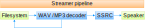

The measurement of streamer pipeline run started at the beginning of `streamer_process_pipelines()`: `streamer.c` and ended in the function `streamer_pcm_write()`: `streamer_pcm.c`  just before the output buffer.

In the scenario involving the WAV codec, the audio file was accessed in every iteration of the streamer pipeline. Meaning, during each run, the file was read directly from the SD card. However, in the case of the MP3 codec, where data processing necessitates complete MP3 frames, the file wasn't read during every run. Rather, it was accessed periodically, triggered when the codec buffer lacked a complete MP3 frame of data. The total time spent on codec processing varies significantly depending on the type and implementation of the codec. For certain types of codecs, like FLAC, there may be multiple file accesses during a single pipeline run. The provided values are specific to the reference implementation. For details about the codecs please see see audio-voice-components documentation `middleware\audio_voice\components\`.

The duration of the streamer pipeline illustrates that with a sampling frequency of 48 kHz, there is no resampling occurring at the SSRC element. Consequently, the overall pipeline time is lower than in the case of 44.1 kHz audio, where resampling takes place.

To enhance comprehension of the system's behavior, histograms of the pipeline run times and its elements are included. The greater time variance with the MP3 codec is precisely due to the absence of file reads in every run. In clusters with shorter times, there are no file accesses, while in clusters with longer times, file reads occur. This indicates that the majority of runs do not involve file access.

 

|       | WAV 48 kHz | WAV 44 kHz | MP3 48 kHz file read | MP3 48 kHz w/o file read | MP3 44 kHz file read | MP3 44 kHz w/o file read |
|-------|------------|------------|----------------------|--------------------------|----------------------|--------------------------|
| mean  | 1.11 ms    | 1.76 ms    | 2.87 ms              | 0.51 ms                  | 3.22 ms              | 0.89 ms                  |
| min   | 1.03 ms    | 1.60 ms    | 2.74 ms              | 0.41 ms                  | 2.33 ms              | 0.74 ms                  |
| max   | 1.29 ms    | 2.23 ms    | 3.24 ms              | 1.83 ms                  | 3.73 ms              | 1.12 ms                  |

 

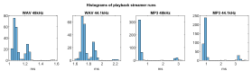

 

### Time on each element

In the tables and histograms below, the timings for individual elements and their connections are provided. Given that the file reading function was invoked during the codec's operation, the tables for individual elements display the total time on the codec element, the time on the codec element before the file read, and the time on the codec element after the file read. The individual blocks in the tables are as follows:

- **streamer** - total time of one pipeline run without time on output buffers
- **codec start** - time on decoder before file read
- **codec end** - time on decoder after file read
- **codec total** - codec_start+codec_end
- **file_src** - file reading time
- **SSRC_proc** - time on SSRC element
- **audio_sink** - time on audio sink without ouput buffers
- **pcm_write** - time on output buffers
- **link** - time on element links

The start times of the time intervals for individual blocks and their respective links were measured by altering the GPIO pin level in the following functions:

- **streamer** - `streamer_process_pipelines()`:`streamer.c`
- **codec** - `decoder_sink_pad_process_handler()`:`decoder_pads.c`
- **file_src** - `filesrc_read()`:`file_src_rtos.c`
- **SSRC_proc** - `SSRC_Proc_Execute()`:`ssrc_proc.c`
- **audio_sink** - `audiosink_sink_pad_chain_handler()`:`audio_sink.c`
- **pcm_write** - `streamer_pcm_write()`:`streamer_pcm.c`
- **link** - `pad_push()`:`pad.c`

 

| WAV 48kHz | streamer  | codec total | codec start | file_src   | codec end  | link codec-SSRC | SSRC_proc   | link SSRC-audio_sink| audio_sink  | pcm_write |
|---------- |-----------|-------------|-------------|------------|------------|-----------------|-------------|---------------------|-------------|-----------|
| mean      | 1.119 ms  | 152 &mu;s   | 31 &mu;s    | 0.843 ms   | 120 &mu;s  | 5 &mu;s         | 64 &mu;s    | 2 &mu;s             | 40 &mu;s    | 20.228 ms |
| min       | 1.026 ms  | 125 &mu;s   | 21 &mu;s    | 0.773 ms   | 104 &mu;s  | <1 &mu;s        | 47 &mu;s    | <1 &mu;s            | 30 &mu;s    | 19.805 ms |
| max       | 1.290 ms  | 193 &mu;s   | 49 &mu;s    | 1.311 ms   | 144 &mu;s  | 23 &mu;s        | 93 &mu;s    | 14 &mu;s            | 91 &mu;s    | 20.324 ms |

 

| WAV 44kHz | streamer | codec total | codec start  | file_src   | codec end | link codec-SSRC | SSRC_proc | link SSRC-audio_sink | audio_sink  | pcm_write |
|-----------|----------|-------------|--------------|------------|-----------|-----------------|-----------|----------------------|-------------|-----------|
| mean      | 1.765 ms | 178 &mu;s   | 44 &mu;s     | 0.853 ms   | 134 &mu;s | 5 &mu;s         | 671 &mu;s | 3 &mu;s              | 42 &mu;s    | 21.472 ms |
| min       | 1.604 ms | 145 &mu;s   | 33 &mu;s     | 0.770 ms   | 112 &mu;s | <1 &mu;s        | 574 &mu;s | <1 &mu;s             | 33 &mu;s    | 18.163 ms |
| max       | 2.233 ms | 218 &mu;s   | 57 &mu;s     | 1.335 ms   | 161 &mu;s | 18 &mu;s        | 715 &mu;s | 5 &mu;s              | 89 &mu;s    | 21.746 ms |

 

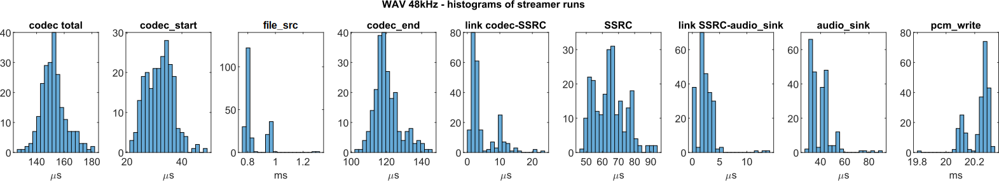
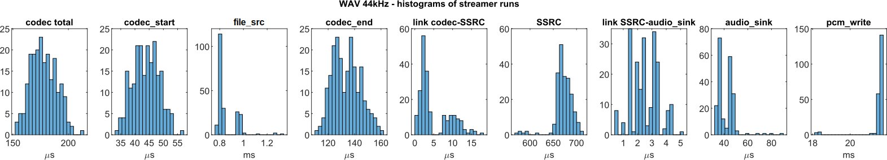

 

| MP3 48 kHz w/ file read |  streamer | codec total | codec start | file_src | codec end | link codec-SSRC | SSRC_proc | link SSRC-audio_sink | audio_sink | pcm_write |
|-------------------------|-----------|-------------|-------------|----------|-----------|-----------------|-----------|----------------------|------------|-----------|
| mean                    | 2.871 ms  | 441 &mu;s   | 279 &mu;s   | 2.271 ms | 162 &mu;s | 6 &mu;s         | 56 &mu;s  | 3 &mu;s              | 50 &mu;s   | 11.019 ms |
| min                     | 2.739 ms  | 353 &mu;s   | 74 &mu;s    | 1.353 ms | 26 &mu;s  | <1 &mu;s        | 40 &mu;s  | <1 &mu;s             | 34 &mu;s   | 10.091 ms |
| max                     | 3.244 ms  | 570 &mu;s   | 409 &mu;s   | 2.728 ms | 467 &mu;s | 18 &mu;s        | 80 &mu;s  | 14 &mu;s             | 62 &mu;s   | 12.910 ms |

 

| MP3 48 kHz w/o file read | streamer | codec total | codec start | file_src | codec end | link codec-SSRC | SSRC_proc | link SSRC-audio_sink | audio_sink | pcm_write |
|--------------------------|----------|-------------|-------------|----------|-----------|-----------------|-----------|----------------------|------------|-----------|
| mean                     | 0.508 ms  | 403 &mu;s  | x           | x        | x         | 8 &mu;s         | 39 &mu;s  | 3 &mu;s              | 36 &mu;s   | 11.326 ms |
| min                      | 0.407 ms  | 208 &mu;s  | x           | x        | x         | <1 &mu;s        | 25 &mu;s  | <1 &mu;s             | 21 &mu;s   | 7.715 ms  |
| max                      | 1.834 ms  | 563 &mu;s  | x           | x        | x         | 41 &mu;s         | 69 &mu;s  | 16 &mu;s             | 104 &mu;s  | 12.941 ms |

 

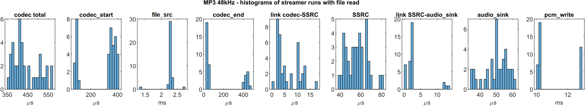
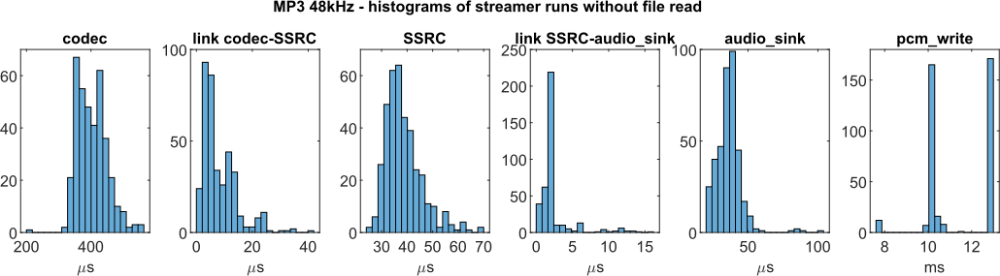

 

| MP3 44 kHz w/ file read | streamer | codec total | codec start | file_src | codec end | link codec-SSRC | SSRC_proc | link SSRC-audio_sink | audio_sink | pcm_write |
|-------------------------|----------|-------------|-------------|----------|-----------|-----------------|-----------|----------------------|------------|-----------|
| mean                    | 3.217 ms | 436 &mu;s   | 367 &mu;s   | 2.300 ms | 66 &mu;s  | 7 &mu;s         | 403 &mu;s | 3 &mu;s              | 51 &mu;s   | 12.188 ms |
| min                     | 2.329 ms | 383 &mu;s   | 73 &mu;s    | 1.411 ms | 26 &mu;s  | 2 &mu;s         | 318 &mu;s | <1 &mu;s             | 35 &mu;s   | 9.119 ms  |
| max                     | 3.726 ms | 547 &mu;s   | 464 &mu;s   | 2.801 ms | 441 &mu;s | 27 &mu;s        | 454 &mu;s | 12 &mu;s             | 65 &mu;s   | 12.529 ms |

 

| MP3 44 kHz w/o file read | streamer | codec total | codec start | file_src | codec end | link codec-SSRC | SSRC_proc | link SSRC-audio_sink | audio_sink | pcm_write |
|--------------------------|----------|-------------|-------------|----------|-----------|-----------------|-----------|----------------------|------------|-----------|
| mean                     | 0.891 ms | 437 &mu;s   | x           | x        | x         | 9 &mu;s         | 388 &mu;s | 3 &mu;s              | 38 &mu;s   | 11.934 ms |
| min                      | 0.738 ms | 268 &mu;s   | x           | x        | x         | <1 &mu;s        | 290 &mu;s | <1 &mu;s             | 22 &mu;s   | 8.964 ms  |
| max                      | 1.115 ms | 620 &mu;s   | x           | x        | x         | 45 &mu;s        | 438 &mu;s | 17 &mu;s             | 92 &mu;s   | 12.624 ms |

 

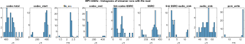
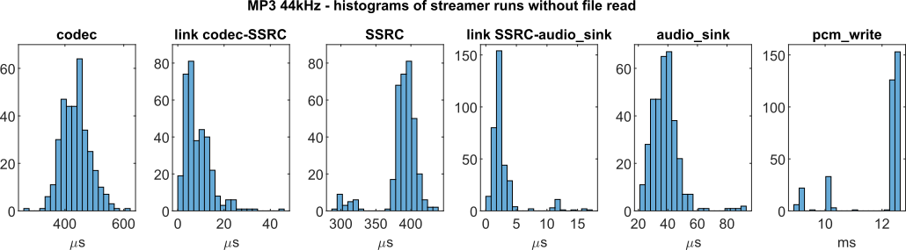

## Maestro record example

Typical execution times of the streamer pipeline and its individual elements for the EVKC-MIMXRT1060 development board are detailed in the following tables. The duration spent on output buffers and reading from the microphone is excluded from traversal measurements. Three measured pipelines are depicted in the figure below. The first involves a loopback from microphone to speaker, supporting both mono and stereo configurations. The second pipeline is a mono voice control setup, comprising microphone and VIT blocks. The final pipeline is a stereo voice control setup, integrating microphone, voice seeker, and VIT blocks. The measurement of streamer pipeline run started at the beginning of `streamer_process_pipelines()`:`streamer.c` and ended in the function `streamer_pcm_write()`: `streamer_pcm.c` just before the output buffer.

 

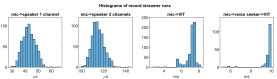

The individual blocks in the tables are as follows:

- **streamer** - total time of one pipeline run without time on output buffers and without time reading from the microphone
- **audio_src_start** - time on audio src before reading from the microphone
- **audio_src_end** - time on audio src after reading from the microphone
- **pcm_read** - reading from the microphone
- **voiceseeker** - time on voice seeker element
- **vit** - time on VIT element
- **audio_sink** - time on audio sink without ouput buffers
- **pcm_write** - time on output buffers
- **link** - time on element links

The start times of the time intervals for individual blocks and their respective links were measured by altering the GPIO pin level in the following functions:

- **streamer** - `streamer_process_pipelines()`:`streamer.c`
- **audio_src** - `audiosrc_src_process()`:`audio_src.c`
- **pcm_read** - `streamer_pcm_read()`:`streamer_pcm.c`
- **voiceseeker** - `audio_proc_sink_pad_chain_handler()`:`audio_proc.c`
- **vit** - `vitsink_sink_pad_chain_handler()`:`vit_sink.c`
- **audio_sink** - `audiosink_sink_pad_chain_handler()`:`audio_sink.c`
- **pcm_write** - `streamer_pcm_write()`:`streamer_pcm.c`
- **link** - `pad_push()`:`pad.c`

### Pipeline Microphone -> Speaker

| microphone -> speaker mono | streamer | audio_src_start | pcm_read  | audio_src_end | link audio_src-audio_sink | audio_sink | pcm_write |
|----------------------------|----------|-----------------|-----------|---------------|---------------------------|------------|-----------|
| mean                       | 43 &mu;s | 3 &mu;s         | 29.938 ms | 29 &mu;s      | <1 &mu;s                  | 10 &mu;s   | 18 &mu;s  |
| min                        | 26 &mu;s | <1 &mu;s        | 29.350 ms | 19 &mu;s      | <1 &mu;s                  | 5 &mu;s    | 12 &mu;s  |
| max                        | 72 &mu;s | 12 &mu;s        | 29.957 ms | 44 &mu;s      | 1 &mu;s                   | 15 &mu;s   | 25 &mu;s  |

 

| microphone -> speaker stereo | streamer  | audio_src_start | pcm_read     | audio_src_end | link audio_src-audio_sink | audio_sink | pcm_write |
|------------------------------|-----------|-----------------|--------------|---------------|---------------------------|------------|-----------|
| mean                         | 115 &mu;s | 5 &mu;s         | 29.861 ms    | 54 &mu;s      | 2 &mu;s                   | 55 &mu;s   | 23 &mu;s  |
| min                          | 94 &mu;s  | <1 &mu;s        | 29.768 ms    | 43 &mu;s      | <1 &mu;s                  | 50 &mu;s   | 12 &mu;s  |
| max                          | 154 &mu;s | 14 &mu;s        | 29.880 ms    | 67 &mu;s      | 8 &mu;s                   | 65 &mu;s   | 49 &mu;s  |

 

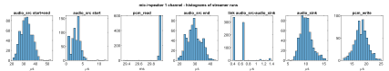
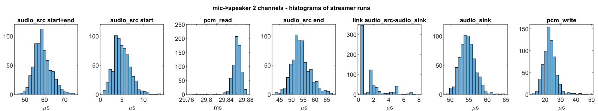

### Pipeline Microphone -> VIT

| microphone -> VIT   | streamer | audio_src_start | pcm_read  | audio_src_end | link audio_src-vit    | vit      |
|---------------------|----------|-----------------|-----------|---------------|-----------------------|----------|
| mean                | 7.380 ms | 30 &mu;s        | 22.624 ms | 78 &mu;s      | 2 &mu;s               | 7.261 ms |
| min                 | 2.641 ms | 10 &mu;s        | 2.2265 ms | 58 &mu;s      | <1 &mu;s              | 2.559 ms |
| max                 | 7.780 ms | 42 &mu;s        | 2.7341 ms | 94 &mu;s      | 5 &mu;s               | 7.624 ms |

 

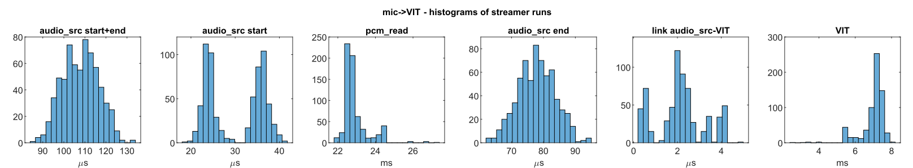

### Pipeline Microphone -> Voice seeker -> VIT

| microphone -> voice seeker -> VIT | streamer  | audio_src_start | pcm_read  | audio_src_end | link audio_src-voiceseeker     | voiceseeker | link voiceseeker-vit    | vit      |
|---------------------------------------------|-----------|-----------------|-----------|---------------|--------------------------------|-------------|-------------------------|----------|
| mean                                        | 9.916 ms  | 22 &mu;s        | 20.084 ms | 84 &mu;s      | 4 &mu;s                        | 2.386 ms    | 13 &mu;s                | 7.407 ms |
| min                                         | 4.983 ms  | 19 &mu;s        | 19.738 ms | 72 &mu;s      | <1 &mu;s                       | 2.228 ms    | 2 &mu;s                 | 2.662 ms |
| max                                         | 10.423 ms | 34 &mu;s        | 24.777 ms | 100 &mu;s     | 7 &mu;s                        | 2.522 ms    | 31 &mu;s                | 7.729 ms |

 

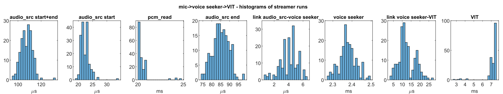

